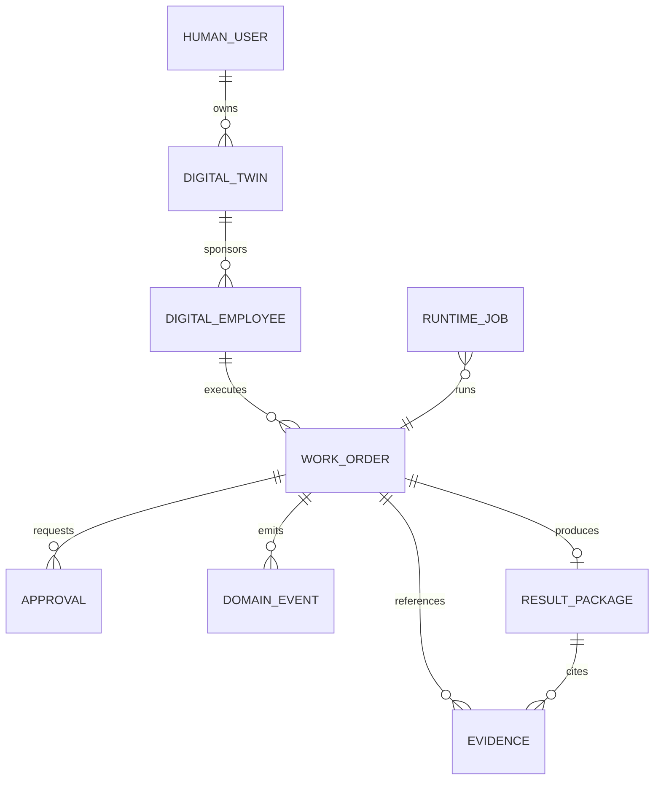

# HUMMER MVP Domain Model

Status: Wave 1 shared model. Names are implementation-neutral and map to the OpenAPI contract.

## 1. Core objects



| Object | Responsibility | MVP minimum |
| --- | --- | --- |
| `HumanUser` | accountable person | `id`, `tenantId`, `displayName`, `role` |
| `DigitalTwin` | a human's delegating digital representative | `id`, `ownerHumanId`, `name`, `authorityLevel` |
| `DigitalEmployee` | a bounded job executor | `id`, `sponsorActorRef`, `jobTitle`, `runtimeProfile`, `autonomyLevel` |
| `WorkOrder` | the authoritative unit of work | goal, scope, inputs, acceptance, budget, owner, state |
| `Approval` | record of a protected action decision | action, risk, requester, approver, decision, rationale |
| `Evidence` | immutable reference supporting a decision or result | source, hash, redacted summary, owner actor |
| `ResultPackage` | reviewable output sent for acceptance | deliverables, criteria verdicts, evidence, cost, risk, rollback |
| `DomainEvent` | append-only fact log | type, actorRef, subject, payload, correlationId, time |
| `RuntimeJob` | execution projection owned by a runtime adapter | workOrderId, adapter, status, traceRef, usage |

## 2. Actor and responsibility rules

- Every `DigitalEmployee` has exactly one `sponsorActorRef`, resolving ultimately to a `HumanUser`.
- Every `WorkOrder` has one accountable `ownerActorRef` and zero or more collaborators.
- A `ResultPackage` may be generated by an employee or system, but acceptance requires a human actor in Wave 1.
- `system:*` can emit operational events but cannot approve protected actions.

## 3. WorkOrder fields

```ts
type WorkOrder = {
  id: string;
  tenantId: string;
  version: number;
  title: string;
  goal: string;
  scope: string;
  inputRefs: string[];
  acceptanceCriteria: Array<{ id: string; text: string; required: boolean }>;
  ownerActorRef: string;
  collaboratorActorRefs: string[];
  assignedEmployeeId: string;
  status: WorkOrderStatus;
  riskLevel: 'low' | 'medium' | 'high';
  budgetLimitCny: number;
  dueAt?: string;
  correlationId: string;
  createdAt: string;
  updatedAt: string;
};
```

## 4. Event envelope

```ts
type DomainEvent<T = Record<string, unknown>> = {
  id: string;
  tenantId: string;
  sequence: number;
  type: string;
  occurredAt: string;
  actorRef: string;
  subjectRef: string;
  correlationId: string;
  causationId?: string;
  previousEventHash?: string;
  eventHash: string;
  data: T;
};
```

The event log is append-only. Current state is a replaceable projection and must be rebuildable from the event log for the MVP data set. Each state-changing command supplies `idempotencyKey` and `expectedVersion`; a duplicate key returns the original result and a stale version fails without emitting a new event.

## 5. RuntimeAdapter boundary

```ts
interface RuntimeAdapter {
  start(input: { workOrder: WorkOrder; runId: string }): Promise<{ jobId: string; traceRef?: string }>;
  resume(input: { jobId: string; approval?: Approval }): Promise<void>;
  cancel(input: { jobId: string; reason: string }): Promise<void>;
}
```

The adapter may emit domain commands through a controlled port only. It must not write directly to UI state or bypass the approval policy.

## 6. Mapping from the current prototype

| Prototype type | MVP target | Migration rule |
| --- | --- | --- |
| `CollabTask` | `WorkOrder` projection | retain existing mock fields as display fields; add canonical IDs and status mapping outside the component layer |
| `RiskAlert` | `Approval` request | preserve its UI but source it from approval data |
| `AuditEntry` | `DomainEvent` projection | retain visual history; hash becomes evidence/event integrity metadata |
| `DeliverableExitAction` | protected `Approval` action | synthetic write-back is the sole initial action |
| `AcceptanceJudgement` | ResultPackage criterion verdict | verdicts live inside the result package, not in unlinked UI state |
