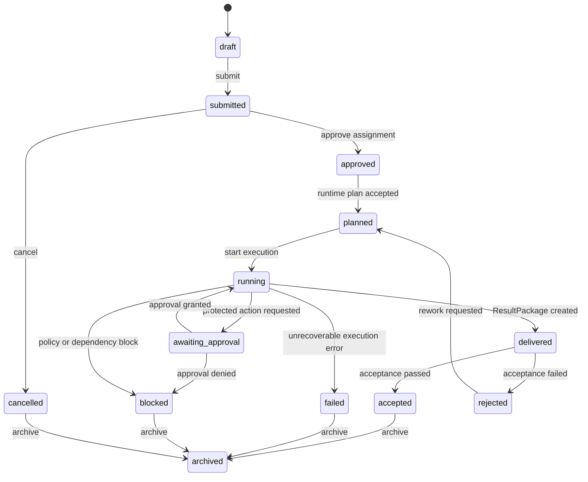

# HUMMER Trusted MVP Contract

Status: frozen for Wave 1 implementation. Contract changes require an ADR and an explicit version bump.

## 1. Purpose and demo loop

This contract proves one trustworthy digital-employee loop rather than the complete organization OS:

```text
Boss creates goal
  -> WorkOrder is confirmed and assigned
  -> digital employee creates a plan and runs a read-only GTM research task
  -> any external write is held for approval
  -> ResultPackage records deliverables, evidence, cost and risk
  -> boss accepts or rejects
  -> audit timeline and ROI projection update
```

The Wave 1 engineering demo uses a synthetic GTM workspace and mock CRM/CSV write-back. It does not decide the final commercial beachhead; a recruitment workflow can reuse the same contract later.

## 2. Non-goals

- No real customer CRM write, external email sending, payment, recruiting contact, or browser automation in Wave 1.
- No multi-tenant production deployment, SSO, billing, marketplace settlement, full RBAC/ABAC, private deployment, or IM bot integration.
- No dependency on a specific model, Agent SDK, LangGraph graph, MCP server, or database vendor in the domain layer.

## 3. Global conventions

| Item | Rule |
| --- | --- |
| ID | opaque, prefixed by type, e.g. `wo_`, `evt_`, `evi_`, `apr_`, `res_` |
| Tenant | every domain object carries `tenantId`; Wave 1 uses `tenant_demo` |
| Time | ISO 8601 UTC strings, e.g. `2026-08-23T09:30:00Z` |
| Actor | `human:<id>`, `twin:<id>`, `employee:<id>`, `system:<id>`, `expert:<id>` |
| Correlation | every request, event and runtime trace carries a `correlationId` |
| Idempotency | every state-changing command carries an `idempotencyKey`; duplicate keys return the original outcome |
| Concurrency | every command carries the aggregate `expectedVersion`; a stale version is rejected rather than overwriting newer facts |
| Facts | business state is reconstructed from immutable events plus a current projection |
| Sensitive values | evidence stores references and redacted summaries, not raw secrets or customer PII |

## 4. WorkOrder state machine



Only the transitions above are valid. `overdue` is a derived SLA condition, not a terminal state.

## 5. Required events

| Event | Emitter | Required data |
| --- | --- | --- |
| `work_order.created` | human/twin | work order snapshot |
| `work_order.submitted` | human/twin | assignment request |
| `work_order.assigned` | human/twin | owner actorRef |
| `work_order.planned` | runtime | plan summary, trace ref |
| `work_order.started` | runtime | runtime job id |
| `approval.requested` | policy/runtime | action, risk, evidence refs |
| `approval.decided` | human | decision, rationale |
| `tool.invoked` | runtime | tool name, read/write class, trace ref |
| `evidence.recorded` | runtime/human | evidence id, SHA-256 of stored bytes, source ref |
| `result_package.created` | runtime | result package snapshot |
| `result_package.accepted` | human | acceptance items, rationale |
| `result_package.rejected` | human | failed criteria, rework request |
| `work_order.failed` | runtime/system | classified error, safe summary |
| `work_order.archived` | system/human | final status |

## 6. Approval policy

| Action class | Wave 1 policy |
| --- | --- |
| read-only research, synthetic file parse | allow and record |
| model output generation | allow and record |
| synthetic CRM/CSV write-back | require approval |
| customer message, external browser write, credential use, finance action | deny; out of MVP scope |

Approval decisions are immutable. A rejection returns the WorkOrder to `blocked`; a rework request is a separate explicit transition to `planned` from `rejected`.

An approval decision only authorizes the protected action. The resulting action execution must emit its own event; a visible "approved" status must never be treated as proof that an external write completed.

## 7. ResultPackage minimum fields

```ts
type ResultPackage = {
  id: string;
  tenantId: string;
  workOrderId: string;
  status: 'delivered' | 'accepted' | 'rejected';
  summary: string;
  deliverables: Array<{ id: string; name: string; kind: 'report' | 'table' | 'recommendation'; uri?: string }>;
  acceptanceCriteria: Array<{ id: string; text: string; verdict: 'pending' | 'passed' | 'failed'; note?: string }>;
  evidenceRefs: string[];
  cost: { modelTokens: number; modelCostCny: number; toolCostCny: number; totalCostCny: number };
  risk: { level: 'low' | 'medium' | 'high'; notes: string[] };
  rollback: { supported: boolean; instructions?: string };
  createdAt: string;
  updatedAt: string;
};
```

## 8. Event integrity and evidence

- `DomainEvent` records a strictly increasing `sequence` within its WorkOrder aggregate. Commands append the event and update the projection in one transaction.
- Each event stores `previousEventHash` and `eventHash`, calculated from canonical, redacted event metadata and payload. This detects alteration in the MVP event chain; it is not represented as a legally immutable ledger.
- `Evidence.hash` is a SHA-256 digest computed from the bytes stored in object storage or a local fixture. Random presentation hashes from the current prototype are not audit evidence.
- Event payloads retain only redacted, policy-safe summaries. Raw files and screenshots stay behind evidence references.

## 9. Directory ownership in Wave 1

| Area | Owner | Editable paths |
| --- | --- | --- |
| Shared contracts | architect only | `docs/architecture/**`, future `packages/contracts/**` |
| Domain/API | Agent A | future `apps/api/**`, `packages/contracts/**` only when assigned |
| WorkOrder/audit | Agent B | future `apps/api/src/work-orders/**`, `apps/api/src/audit/**` |
| Runtime | Agent C | future `apps/api/src/runtime/**`, `apps/worker/**` |
| UI | Agent D | `src/components/**`, `src/pages/**`, `src/data/**`, `src/store/**` via adapters |
| QA/integration | Agent E | `tests/**`, test configuration, CI; no feature rewrites |

Until the target paths exist, implementation agents must create only the paths their ticket authorizes.
