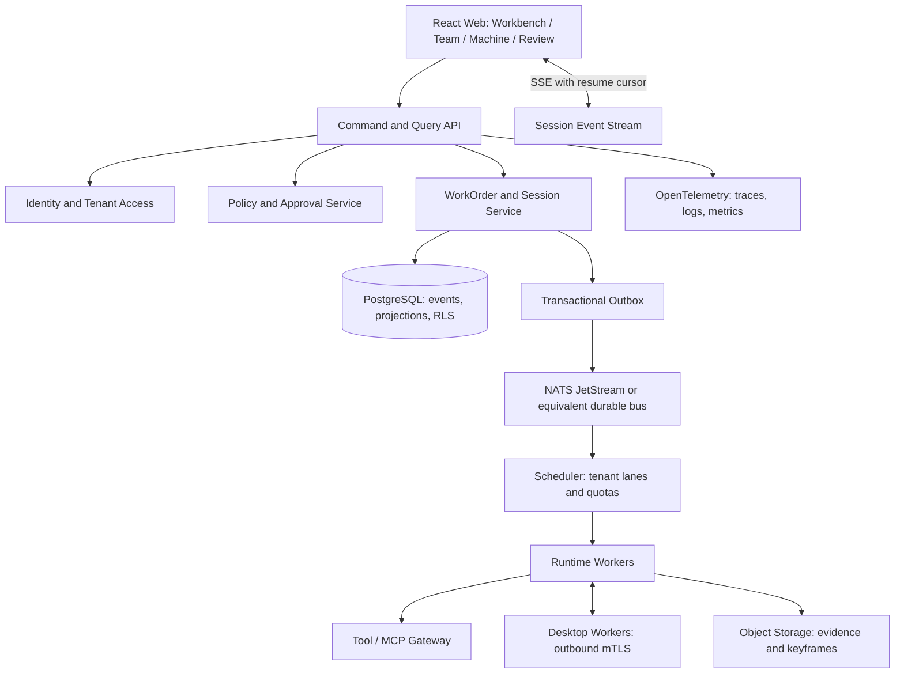

# HUMMER V3 开发说明书：可信会话、多租户控制面与高并发运行时

状态：架构与实施基线。本文将既有研究报告、V3 整改意见和可信 MVP 契约收敛为后续工程决策；它不替代已冻结的 `docs/architecture/mvp-contract.md`。修改 WorkOrder、ResultPackage 或 API 契约时仍需先写 ADR。

## 1. 目标与非目标

V3 的工程目标不是做一个“会聊天的企业门户”，而是让一个受控 Agent 会话可以被创建、执行、停止、审批、审计和复跑，并能在生产演进中支持多账户、多租户、桌面 Worker 和高并发事件流。

首个真实闭环仍为：**GTM 研究 → 合成或受控数据处理 → 保护动作审批 → ResultPackage → 验收/坏例 → SOP 分支复跑。** 任何 CRM、邮件、IM、支付或桌面写入都必须通过单独的连接器、策略和验收后才开放。

非目标：一次性做完组织 OS、全量 ERP/CRM 接入、通用 Agent 市场、跨租户协作、财务结算、无限自治和未验证的性能承诺。

## 2. V3 参考实现边界

| 参考 | 可以借鉴 | 不应直接搬运 |
| --- | --- | --- |
| Codex / Codex App | 工作区绑定、AGENTS.md 式岗位 SOP、受控工具、可见 diff、人与 Agent 换手 | 把个人本地会话当作企业授权与审计系统 |
| WorkBuddy | 快速雇佣、临时小组、面向结果的任务拆解 | 无责任人、无租户边界的自由编排 |
| DeepSeek Harness | session-first、resume/fork/replay、轨迹与插件槽 | 与业务对象强耦合的内部实现或未核验许可证代码 |
| MCP / OpenClaw / EasyClaw | 工具适配、连接器生态、消息触发 | 将编排框架误当作授权、凭证托管或审计层 |
| Temporal / NATS / 工作流组件 | 长流程恢复、消息持久化、重试和限流 | 在 Wave 1 为简单 WorkOrder 引入无法运营的复杂集群 |

任何第三方仓库进入源代码前必须核实许可证、版本、依赖树、数据出境和供应链风险。领域模型只依赖内部契约，不依赖某个模型厂商、Agent SDK 或编排框架。

## 3. 逻辑架构



### 3.1 推荐选型

| 层 | Wave 1 | 扩展路径 | 选择理由 |
| --- | --- | --- | --- |
| 前端 | 既有 React + TypeScript + Vite | TanStack Query、SSE client、设计系统整理 | 复用当前原型并避免重写 |
| API | TypeScript + Fastify + Zod | 独立 Command/Query 服务 | 与现有 TS 领域层共享类型；高并发入口轻量 |
| 事务库 | PostgreSQL | 主从、分区、读模型 | WorkOrder 事件、审批和版本检查需强事务 |
| 缓存与限流 | Valkey/Redis | 分片和独立 rate-limit service | 幂等窗口、会话游标、租户令牌桶 |
| 消息与 Worker | NATS JetStream | 分区 subject、独立 worker pools | 低运维的持久事件和消费者恢复；超过该边界后再评估 Kafka |
| 长流程 | 领域状态机 | Temporal 仅用于跨天流程 | 先保持 WorkOrder 状态机可读、可测 |
| 工具网关 | MCP Adapter + 内部 Tool Contract | 专用 connector service | 工具声明、风险分类、批准和审计统一化 |
| 证据 | S3 兼容对象存储 / MinIO | 内容寻址、保留策略 | 原始文件、关键帧和大对象不写入事件库 |
| 可观测性 | OpenTelemetry + Prometheus/Grafana | trace backend | 以 correlationId 贯穿 API、队列、工具和桌面会话 |

## 4. 核心领域与数据隔离

### 4.1 多账户与多租户

`UserAccount` 是人类登录身份；`Tenant` 是数据、预算、凭证、策略和审计的隔离边界；`Membership` 定义一个账户在一个租户中的角色。一个账户可以有多个 Membership，但任何请求必须携带一个明确的 `tenantId` 和不可伪造的 active membership。

建议的最小表：

| 表 | 关键字段 | 约束 |
| --- | --- | --- |
| `tenants` | `id`, `plan`, `status`, `data_region` | 租户生命周期和地域 |
| `user_accounts` | `id`, `subject`, `status` | 不携带租户业务数据 |
| `memberships` | `tenant_id`, `account_id`, `role`, `attributes` | `(tenant_id, account_id)` 唯一 |
| `service_identities` | `tenant_id`, `owner_ref`, `scope` | 仅用于连接器和 Worker |
| `digital_employees` | `tenant_id`, `owner_ref`, `agent_package_version` | owner 不可为空 |
| `work_orders` | `tenant_id`, `version`, `status` | 写命令带 `expectedVersion` |
| `execution_sessions` | `tenant_id`, `work_order_id`, `branch_id`, `parent_session_id` | 分支不改写父会话 |
| `domain_events` | `tenant_id`, `aggregate_id`, `sequence`, `event_hash` | `(aggregate_id, sequence)` 唯一 |
| `approvals` | `tenant_id`, `work_order_id`, `policy_decision` | 审批不可变 |
| `evidence` | `tenant_id`, `object_uri`, `sha256`, `retention_class` | 原始文件只在对象存储 |
| `tenant_quotas` | `tenant_id`, `concurrency`, `budget`, `rate_limit` | 调度器与网关共同执行 |
| `audit_entries` | `tenant_id`, `actor_ref`, `correlation_id` | 追加式写入 |

每个业务表都要带 `tenant_id`，在数据库启用 Row-Level Security，并由服务端在事务内设置可信租户上下文。不要只靠前端参数或 ORM 条件过滤。对象存储路径必须以 tenant prefix 分区，下载使用短期签名 URL 且二次校验 Membership。

### 4.2 身份、授权与凭证

1. 支持 OIDC/OAuth 登录；企业版再接 SAML、SCIM 和目录同步。
2. 采用 RBAC 提供岗位角色，ABAC 限定地域、部门、数据分类、预算和时间窗，必要时再引入 ReBAC 表达委派关系。
3. 数字分身和数字员工不是用户账号的复制品，而是具有 owner、service identity、权限模板和过期时间的受控主体。
4. 外部连接器凭证放在 KMS/Vault 管理的密文库，Worker 只取得短期、最小范围令牌；事件和 ResultPackage 只写凭证引用与脱敏摘要。
5. 停止会话时撤销桌面令牌、取消排队作业、停止工具重试，并追加 `session.stopped`/审计事件。

## 5. 可信命令、事件与会话

### 5.1 命令路径

```text
POST /v1/tenants/{tenantId}/work-orders/{id}/commands
  Authorization + active membership
  + idempotencyKey + expectedVersion + correlationId
  -> authorization and policy check
  -> PostgreSQL transaction: append DomainEvent + projection + outbox row
  -> 202/200 command receipt
  -> outbox relay publishes to worker lane
```

- 同一 `idempotencyKey` 返回首次回执，绝不重复发起外部工具调用。
- `expectedVersion` 不匹配返回 `409 stale_version`，调用方重新读取投影后再决定。
- 审批只改变授权状态；真正工具执行还必须写入独立 `tool.invoked`、`tool.completed` 或 `tool.failed` 事件。
- 轨迹是 Session 的读模型：它聚合 WorkOrder 事件、工具 trace、桌面关键帧和人工 handoff，但不是另一套事实来源。

### 5.2 Session 与复跑

`ExecutionSession` 必须包含 `tenantId`、`workOrderId`、`branchId`、`parentSessionId`、沙箱范围、审批模式、能力快照、检查点、SOP 版本和事件游标。`fork` 创建新会话与新 WorkOrder 执行上下文，保留父会话输入和证据引用；绝不修改父会话的事件历史。

复跑请求需要记录：来源检查点、SOP diff、模型/工具/知识版本、输入快照指针、批准人和结果对比。只有完成评测、风险检查和真人批准的 SOP revision 才能升级为岗位默认版本。

## 6. 高并发设计

### 6.1 目标是可验证，不是口头“高并发”

以下是设计 SLO，必须通过压测和故障演练后才能对外承诺：

| 指标 | 初始目标 | 验证方式 |
| --- | --- | --- |
| 命令接收 p95 | 小于 300 ms（不含模型与工具时间） | k6/vegeta 对 API command path |
| 事件可见延迟 p95 | 小于 1 s | API、outbox、bus、SSE 的 correlationId 对账 |
| 幂等正确性 | 重复命令不重复执行 | 并发重复请求和 worker crash 注入 |
| 租户公平性 | 单租户耗尽配额不饿死其他租户 | tenant lane 压测 |
| 恢复 | worker 或 SSE 断线后从游标继续 | kill/restart 与 replay 演练 |
| 证据完整性 | 100% 结果包能回查 evidence hash | 审计抽样与对象存储校验 |

容量分阶段验证：先在预发证明 1,000 个活跃会话与 100 个并发 Worker 任务的公平调度；再根据真实模型、工具和桌面成本设定 10,000 会话级别的目标。模型调用吞吐、浏览器实例数和桌面节点数分别压测，不能把它们混成一个虚假的 QPS 数字。

### 6.2 分片、背压和恢复

1. **租户 lane。** `tenantId` 是队列路由键之一；每个租户有并发、预算、工具和事件带宽上限。高优先级审批不能被低价值批任务饿死。
2. **会话顺序。** 同一 WorkOrder/Session 的状态转移按 aggregate sequence 串行化；不同会话可并行。不要用全局锁。
3. **Transactional outbox。** 数据库事件与 outbox 在同一事务写入；relay 可至少一次投递，consumer 依靠事件 ID 去重。
4. **背压。** 当 Worker、模型、工具或对象存储逼近阈值，调度器暂停低优先级任务、降低自治等级或进入 `blocked`，而不是无限重试。
5. **SSE 恢复。** 浏览器以 `Last-Event-ID` / cursor 重连；服务只推 tenant-和 membership-授权范围内的事件，超过窗口时回退到 paged trajectory 查询。
6. **冷热分层。** PostgreSQL 保留当前投影和近期事件；历史事件按租户哈希与月份分区。大证据、关键帧和日志写对象存储，事件只留 hash、URI、摘要和访问策略。

### 6.3 桌面 Worker

桌面 Worker 必须由受管理设备向控制面建立 mTLS 出站长连接，不开放用户电脑的入站端口。会话令牌绑定 tenant、worker、workspace、工具集合、预算、过期时间和只读/写入能力；任何范围变化都创建新令牌和审计事件。关键帧、窗口标题、文件 diff 和工具结果分别脱敏、加密并按保留策略存储。

真实桌面自动化在 Wave 1 后先进入隔离的测试租户：无个人账户持久登录、无生产 CRM、无本地任意路径访问、无未审批外网导航。

## 7. API 与读模型

在不修改现有 `api-contract.yaml` 前，V3 需要新增 ADR 后才能实现的候选接口包括：

| 接口 | 用途 |
| --- | --- |
| `POST /v1/tenants/{tenantId}/sessions` | 从已批准 WorkOrder 创建会话 |
| `POST /v1/.../sessions/{id}/commands` | pause、resume、stop、fork、handoff、approval decision |
| `GET /v1/.../sessions/{id}/trajectory` | 分页读轨迹、工具和证据摘要 |
| `GET /v1/.../sessions/{id}/events` | SSE，可恢复游标 |
| `POST /v1/.../agent-trials` | 创建受控试用并分配 owner、scope、期限 |
| `GET /v1/.../governance/overview` | 管理员读取隔离、容量、风险与审计投影 |

命令与查询分离：命令返回 receipt 与新版本；查询返回投影与 event cursor。任何需要外部副作用的接口均异步执行，不把模型或桌面运行时间塞进 HTTP 请求生命周期。

## 8. 开发计划与质量门槛

### Wave A：原型和领域契约

- 保持 React 原型可交互，所有合成资源显著标识。
- 以纯函数实现 WorkOrder、ResultPackage、ExecutionSession、审批和 fork/replay；先写单元测试。
- 验证单条主线和 V3 四导航验收，不新增 PageKey。

### Wave B：可信单租户后端

- Fastify API、PostgreSQL、迁移、Zod schema、认证 mock、对象存储 fixture。
- WorkOrder 事务、版本冲突、幂等、审批、证据 SHA-256、outbox 和最小 runtime adapter。
- 集成测试覆盖“批准不等于执行”“停止撤销令牌”“结果包可回查”。

### Wave C：受控多租户与运行时

- OIDC、Membership、RLS、tenant quotas、租户 lane、SSE 游标、审计导出。
- Tool/MCP gateway、短期凭证、单一 Desktop Worker 测试租户、OpenTelemetry。
- 安全测试覆盖跨租户越权、过期令牌、工具 scope 扩张、事件重放。

### Wave D：容量与组织闭环

- 按前述分阶段目标压测 API、队列、模型、工具和桌面节点。
- 建立 SLO、错误预算、告警、备份恢复与混沌演练。
- 将坏例评测、SOP 签名、灰度和回滚做成完整发布链，再开放部门包。

## 9. 测试矩阵

| 层级 | 必测内容 |
| --- | --- |
| Unit | 状态机、幂等、版本冲突、审批模式、fork/replay、预算和策略判定 |
| Contract | API schema、事件 envelope、SSE cursor、MCP tool manifest |
| Integration | PostgreSQL + RLS + outbox + queue + object evidence |
| E2E | 工作台主线、两步试用、节点隔离、控制塔授权、失败后复跑 |
| Security | 跨租户读取、服务身份越权、密钥泄漏、拒绝审批后的副作用 |
| Load | tenant fairness、backpressure、SSE reconnect、worker crash、证据写入峰值 |
| Recovery | DB/worker/relay 重启、重复事件、部分成功工具调用、审计对账 |

发布门槛：类型检查、单元/界面/集成测试、E2E、迁移回滚演练、容量报告和安全评审均通过；没有真实压测证据时，控制塔只能标记为“设计态/演示态”。

## 10. 当前代码与后续边界

当前原型已在 `src/features/sessions/model/` 建立会话领域模型，并复用 `src/features/work-orders/model/` 的 WorkOrder 与 ResultPackage。它是合成、前端内存态实现，不能被当作生产状态存储或真实桌面 Runtime。

后端落地时，UI 不应复制领域状态机；应通过 command/query adapter 读取 API 投影。共享契约建议迁移到 `packages/contracts/`，但这需要按已有工程规约和 ADR 分阶段进行，避免一次性改动冻结契约或 API YAML。
