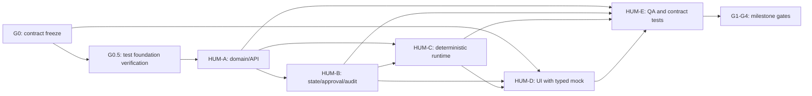

# HUMMER MVP Swarm Plan

Status: executable Wave 0/Wave 1 plan.
Owner: Codex is architect, contract owner, integration reviewer, and release gatekeeper. WorkBuddy provides isolated implementation agents.
Last reviewed: 2026-08-23.

## 1. Objective and success definition

HUMMER is moving from a React/Vite product prototype to a trusted AI-native organization MVP. Wave 1 proves one complete, deterministic, synthetic GTM loop rather than the full organization OS:

```text
boss creates a goal
  -> WorkOrder is confirmed and assigned
  -> one digital employee performs safe GTM research
  -> a synthetic CRM/CSV write pauses for human approval
  -> ResultPackage contains deliverables, evidence, cost, risk, and rollback
  -> human accepts or rejects
  -> audit timeline and ROI projection update
```

Wave 1 is successful only when the loop is visible in the UI and reconstructable from server-side facts. A polished mock screen without a replayable WorkOrder/event/result chain does not pass.

## 2. Current repository baseline

The repository is an existing Vite + React + TypeScript prototype. Preserve it; do not rewrite the frontend during Wave 1.

- Frontend: React 18, Vite, TypeScript, Tailwind, Zustand, React Three Fiber, Framer Motion, Lucide.
- Existing checks/scripts: `npm run typecheck`, `npm run build`, `npm run test:unit`, `npm run test:ui`, `npm run test:e2e`.
- Existing test configuration: Vitest node tests, Vitest jsdom UI tests, Playwright browser tests.
- Existing browser smoke directory: `e2e/**`.
- Existing product state is largely local mock data and Zustand projections. It must not remain the source of truth for the trusted loop.
- `apps/api/**` and `packages/contracts/**` are target paths for the MVP control plane and may be created only by their assigned tickets.

Before Wave 0 is accepted, Codex runs and records:

```text
git status --short
npm run typecheck
npm run build
npm run test:unit
npm run test:ui
npx playwright test --list
```

Do not install a second test stack. If a script or fixture is missing, create a small, explicit repair ticket. Do not claim `test:api`, `test:domain`, or `test:runtime` until those scripts are added and run successfully.

## 3. Product and technical boundary

### In scope for Wave 1

- Synthetic tenant and synthetic GTM workspace.
- Human user, digital twin, digital employee, WorkOrder, Approval, Evidence, ResultPackage, DomainEvent, and RuntimeJob minimum models.
- Contract-compatible create/get WorkOrder API.
- Validated WorkOrder state machine.
- Append-only event log with increasing aggregate sequence and hash chain.
- Idempotency and optimistic version checks.
- Deterministic MockRuntimeAdapter.
- Safe read-only GTM research task.
- Synthetic CRM/CSV write-back that always pauses for human approval.
- Human approval decision and immutable rationale.
- ResultPackage with deliverables, criterion verdicts, evidence references, SHA-256, cost, risk, and rollback information.
- Boss-to-acceptance UI flow using a typed client and repository boundary.
- Audit timeline, bad-case/rejection path, and simple ROI projection.
- Unit, contract, integration, and browser smoke coverage.

### Explicitly out of scope

- Real CRM writes, outbound email, customer contact, payment or finance action.
- Real customer data, PII, production credentials, or long-lived tokens.
- Uncontrolled browser automation, external network calls, or production MCP servers.
- Production multi-tenancy, SSO, full RBAC/ABAC/ReBAC, private deployment, Kubernetes, billing settlement, or IM bots.
- Generic Agent Marketplace, expert settlement, recruitment contact workflow, or complete L1/L2/L3 platform.
- Rewriting the current visual system or replacing the current frontend framework.
- Introducing Temporal, LangGraph, OpenAI Agents SDK, or another runtime framework before the deterministic adapter boundary is tested.

## 4. Operating model

Parallelize construction, centralize interfaces and acceptance.

- Codex owns scope, architecture documents, shared contracts, dependency decisions, integration order, review, and milestone gates.
- WorkBuddy agents own only the paths and behavior named in their ticket.
- One agent uses one branch/worktree. No shared live write directory.
- Agents do not self-merge and do not silently repair another agent's domain.
- Contracts are frozen by version. A public type, event, status, or API change requires a Codex-approved ADR and version bump.
- Every handoff must include changed paths, behavior/API/state changes, exact checks, contract impact, risks, rollback, and commit SHA.

Branch layout:

```text
main
  ├─ chore/test-foundation
  ├─ feat/domain-api
  ├─ feat/work-order-audit
  ├─ feat/runtime-adapter
  ├─ feat/frontend-trusted-loop
  └─ feat/qa-integration
```

## 5. Shared contract rules

The following documents are frozen before feature implementation:

- `AGENTS.md`
- `docs/architecture/mvp-contract.md`
- `docs/architecture/domain-model.md`
- `docs/architecture/api-contract.yaml`
- `docs/decisions/ADR-001-mvp-boundary.md`

Contract invariants:

- Opaque prefixed IDs: `wo_`, `evt_`, `evi_`, `apr_`, `res_`, `run_`.
- Every domain object is tenant-scoped.
- Every request, event, and runtime trace has a `correlationId`.
- Every state-changing command has an `idempotencyKey` and `expectedVersion`.
- Actor refs use `human:`, `twin:`, `employee:`, `system:`, or `expert:`.
- State changes emit events; projections can be rebuilt from events for the Wave 1 data set.
- High-risk writes require human approval. `system:*` cannot approve protected actions.
- Evidence contains references, redacted summaries, and SHA-256 of stored bytes; it does not contain secrets or raw sensitive records.
- Runtime code emits controlled domain commands and cannot bypass policy or write directly to UI state.

## 6. Test and quality gates

### Test pyramid

1. Unit: validation, state transitions, policies, idempotency, event append, hashing, cost, result validation.
2. Contract: OpenAPI request/response fixtures and TypeScript client compatibility.
3. Integration: in-memory API, deterministic runtime, event-log projection, restart/rebuild.
4. Browser smoke: create WorkOrder -> run -> approve synthetic write -> accept ResultPackage -> inspect evidence/audit.

### Required quality rules

- Test the acceptance behavior before or alongside implementation.
- Use deterministic clock and fixtures for runtime and event ordering tests.
- No test depends on network access or a real customer system.
- Every defect gets a regression test.
- Required failures are reported, never hidden or weakened by deleting assertions.
- Shared TypeScript changes require `npm run typecheck` and `npm run build`.

## 7. Wave 0: architecture freeze

Owner: Codex.

Deliverables:

- The five shared documents listed above.
- A repository preflight report with baseline check results.
- This plan and the operational collaboration protocol.
- A written list of ticket ownership and locked shared files.

Acceptance gate G0:

- MVP in-scope and out-of-scope lists are approved.
- WorkOrder state machine and event names are frozen.
- RuntimeAdapter and UI repository boundaries are frozen.
- Baseline typecheck/build/test results are recorded.
- No feature agent starts before G0 is accepted.

## 8. Wave 0.5: test foundation verification

The repository already contains the main test dependencies and configuration. This wave is verification and small repair, not a blind dependency installation.

| Field | Instruction |
| --- | --- |
| Owner | Codex or Agent E, with explicit approval for any dependency change |
| Allowed paths | `package.json`, lockfile only when required, test configuration, `tests/**`, `e2e/**`, CI configuration |
| Must verify | Vitest node tests, Vitest jsdom UI tests, Playwright browser tests, and named scripts run from a clean checkout |
| Must add if missing | A focused sample state-machine test, one existing-app browser smoke, and scripts for API/domain/runtime suites only if their suites exist |
| Must not do | Do not upgrade unrelated packages, rewrite feature code, or install a second testing framework |
| Acceptance | Current prototype checks stay green; one documented command can run the available suite; missing checks are tracked as explicit tickets |
| Rollback | Dedicated dependency/config commit can be reverted without feature changes |

## 9. Wave 1 tickets

### HUM-A: Domain model and API foundation

| Field | Instruction |
| --- | --- |
| Owner | WorkBuddy Agent A |
| Branch | `feat/domain-api` |
| Allowed paths | `apps/api/**`, `packages/contracts/**`, focused tests under those paths |
| Forbidden paths | `src/**`, `docs/architecture/**`, runtime feature folders, audit feature folders owned by B |
| Depends on | G0 contract freeze; may use interface fakes approved by Codex |
| Build | Small TypeScript control plane compatible with the repository. Use in-memory persistence first. Keep a future database behind a repository boundary. |
| Must implement | WorkOrder create/get, tenant and actor validation, canonical types, repository port, correlation/idempotency/version inputs |
| Must prove | Valid WorkOrder is created in `draft`; invalid actor, tenant, criteria, budget, or ID is rejected; invalid state cannot be constructed |
| Tests | Validation, repository behavior, create/get API contract fixtures, idempotency input handling |
| Acceptance | Focused API tests, typecheck, build, and contract fixture validation pass |
| Rollback | Revert the isolated API/contracts commit; no UI state should depend directly on its internal implementation |

### HUM-B: WorkOrder lifecycle, approval, audit, and evidence

| Field | Instruction |
| --- | --- |
| Owner | WorkBuddy Agent B |
| Branch | `feat/work-order-audit` |
| Allowed paths | `apps/api/src/work-orders/**`, `apps/api/src/audit/**`, `apps/api/src/evidence/**`, focused tests |
| Forbidden paths | `src/**`, `docs/architecture/**`, runtime implementation, public contract changes without Codex approval |
| Depends on | HUM-A contracts/repository boundary; may start with an approved interface fake |
| Must implement | Allowed transitions, append-only events, increasing sequence, event hash chain, approval request/decision, evidence SHA-256/reference, idempotency, stale-version rejection |
| Must prove | Only valid transitions occur; rejected approval cannot execute a protected write; approval decisions are immutable; duplicate commands do not duplicate effects; event payloads are redacted |
| Tests | Table-driven transition tests, denied approval, event order/hash test, stale-version test, idempotency test, evidence hash test, sensitive-payload redaction test, event-log rebuild test |
| Acceptance | Focused domain tests, API contract validation, typecheck, and build pass |
| Rollback | Revert the ticket commit; projections can be rebuilt from seed event fixtures |

### HUM-C: RuntimeAdapter and deterministic mock run

| Field | Instruction |
| --- | --- |
| Owner | WorkBuddy Agent C |
| Branch | `feat/runtime-adapter` |
| Allowed paths | `apps/api/src/runtime/**`, optional `apps/worker/**`, focused tests |
| Forbidden paths | `src/**`, shared domain schema/event definitions, credentials, network integrations, real browser/CRM integration |
| Depends on | HUM-A RuntimeAdapter boundary and HUM-B controlled command/policy port |
| Must implement | Deterministic synthetic GTM research run, tool trace events, evidence/result creation, synthetic write pause, approval resume, classified failure |
| Must prove | Run can start safely; read-only research proceeds; synthetic write always pauses; only approved action resumes; result cost is aggregated; tool traces are redacted |
| Tests | Fake-clock run, pause/resume, denied approval, trace redaction, result/cost aggregation, cancellation/failure classification |
| Acceptance | Focused runtime tests, typecheck, build, and no-network execution pass |
| Rollback | Remove the `mock` adapter registration without deleting domain facts or contract types |

### HUM-D: Trusted loop UI and adapters

| Field | Instruction |
| --- | --- |
| Owner | WorkBuddy Agent D |
| Branch | `feat/frontend-trusted-loop` |
| Allowed paths | `src/components/**`, `src/pages/**`, `src/data/**`, `src/store/**` only through an adapter boundary, `src/adapters/**` if created, UI tests, approved route registration |
| Forbidden paths | `apps/api/**`, `packages/contracts/**`, `docs/architecture/**`, unrelated visual redesign, direct domain mutation from components |
| Depends on | Frozen API contract; typed mock client is allowed before live API integration |
| Must implement | Boss creates WorkOrder; sees assignment/run/approval; sees ResultPackage, evidence, cost, risk; accepts/rejects; sees audit timeline and simple ROI; preserve current enterprise visual language |
| Must prove | UI remains usable without live API; mock and API client share the same types; refresh/restart does not pretend local UI state is server truth in the integrated path |
| Tests | Pending approval component test, acceptance/rejection test, adapter mapping test, complete mock-loop browser smoke |
| Acceptance | `npm run test:ui`, `npm run typecheck`, `npm run build`, and approved browser smoke pass |
| Rollback | Remove the new route/adapter feature without altering existing office dashboard behavior |

### HUM-E: QA, contract, and integration gate

| Field | Instruction |
| --- | --- |
| Owner | WorkBuddy Agent E |
| Branch | `feat/qa-integration` |
| Allowed paths | `tests/**`, `e2e/**`, test configs, CI workflow, test-only fixtures |
| Forbidden paths | Feature implementation rewrites, semantic contract changes, unrelated UI changes |
| Depends on | G0 plus each available Wave 1 ticket; may add tests continuously |
| Must implement | Contract fixtures, state-machine regression suite, runtime-to-UI smoke, rejected approval path, rejected result path, audit/evidence checks, restart/rebuild check |
| Must prove | Tests fail on unauthorized write, invalid transition, duplicate command, missing evidence hash, and stale version |
| Acceptance | One documented local command runs the applicable full suite; typecheck/build remain green; failures are classified as product defect, integration defect, or environment defect |
| Rollback | Test additions are removable independently; do not weaken or delete existing prototype smoke coverage |

## 10. Dependency graph



## 11. Launch sequence

1. Codex completes G0 and commits the frozen documents.
2. Verify G0.5. Do not reinstall dependencies already present; add only approved missing scripts/fixtures.
3. Start HUM-A and HUM-D in parallel. HUM-D uses the typed mock client.
4. Review HUM-A's public types, repository boundary, and API fixtures.
5. Start HUM-B and HUM-C in parallel after HUM-A acceptance or an explicit Codex-approved interface fake.
6. Keep HUM-E writing regression tests and checking contract drift, without changing feature implementations.
7. Integrate in this order: contracts/API -> lifecycle/audit -> runtime -> UI -> QA.
8. Run the milestone gate. Any failed required check blocks the next wave.

## 12. Milestone gates

| Gate | Required evidence | Owner | Blocks |
| --- | --- | --- | --- |
| G0 contract | Frozen documents, ownership map, baseline report | Codex | All implementation |
| G0.5 test foundation | Existing test stack verified; missing checks ticketed | Codex + E | Feature claims of TDD |
| G1 domain | Valid/invalid WorkOrder tests, API fixtures, tenant/actor/version checks | A + Codex | B/C integration |
| G2 execution | State transitions, approval pause/resume, evidence hash, ResultPackage tests | B + C | D live integration |
| G3 experience | Boss-to-acceptance browser smoke, audit/evidence/ROI visible | D + E | Release candidate |
| G4 release candidate | Full applicable suite, typecheck, production build, review, rollback point | Codex + E | Wave 2 |

## 13. Wave 1 acceptance measures

- Across ten deterministic demo runs, every WorkOrder has a tenant, actor, correlation trace, increasing event sequence, and intact event hash chain.
- A protected synthetic write is blocked before approval in every run; a rejected approval never emits a successful protected-write event.
- Every ResultPackage includes criterion-level verdicts, evidence SHA-256s, source references, cost, risk, and rollback information.
- After service restart, WorkOrder state, approval decisions, evidence references, and the audit timeline can be reconstructed from the event log rather than browser state.
- Five seeded scenarios have an explicit rubric; at least four pass, and every failure is replayable and classified.
- A boss can create, run, approve, reject/accept, and inspect a task in under five minutes through task, inbox, deliverable, and audit screens without relying on chat as the fact source.
- No real network, external write, customer record, or long-lived credential is used in G0-G4.

## 14. Wave 2 candidates, not Wave 1 commitments

Only after G4 passes, Codex may create separate proposals for:

- PostgreSQL and durable repository implementation.
- A real RuntimeAdapter behind the tested boundary.
- Temporal or LangGraph for long-running orchestration.
- OpenFGA/Casbin/OPA-style policy service.
- Desktop Worker and Playwright/RPA integration.
- One IM connector, multi-tenant operations, SSO, private deployment, or billing.
- Digital employee lifecycle, trial, certification, evolution, and ROI expansion.

These are deliberately excluded from the current swarm so the first result is a trustworthy vertical slice rather than a collection of disconnected platform components.
