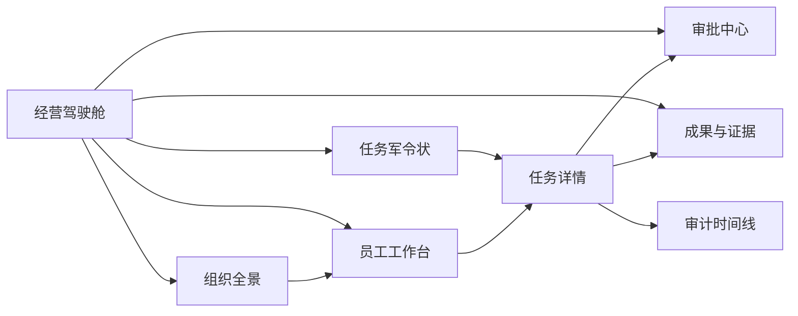
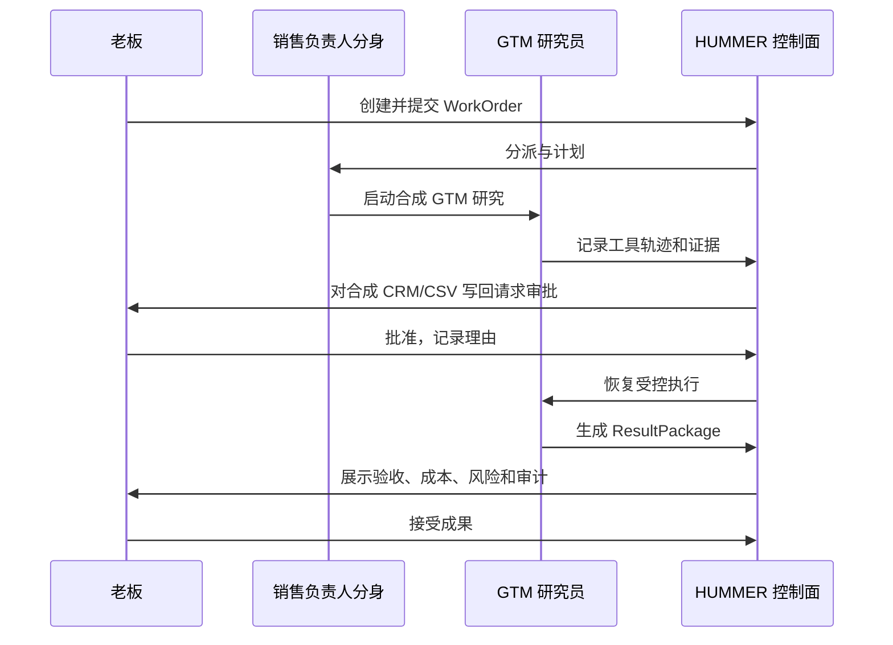

# HUMMER V1 产品原型说明书

状态：`草案，等待产品确认`  
版本：0.1  
日期：2026-08-25  
关联：`docs/research/2026-08-market-entry-analysis.md`、`docs/research/2026-08-technical-product-spec.md`、`docs/architecture/mvp-contract.md`

## 1. 本版要确认什么

HUMMER 不以“又一个 Agent 搭建器”进入市场，而是以一个可被业务负责人购买、可被员工协同、可被审计和验收的产品进入企业：

> **HUMMER V1 是“可信数字员工经营系统”：让老板把一个明确业务目标委派给带岗位、权限、预算和责任人的数字员工，并在统一的审批、证据、成果和复盘闭环中完成。**

这版原型要让用户在五分钟内完成并看懂一件事：

```text
老板提出一个 GTM 目标
  -> 销售负责人分身接单并分派数字员工
  -> 数字员工完成安全的资料研究
  -> 要写入 CRM/CSV 时停在审批关口
  -> 真人批准或拒绝
  -> 系统交付可验收成果包和证据
  -> 老板看到业务结果、风险和投入产出
```

“公司全景”仍是 HUMMER 的品牌记忆点，但不再承担数据真实性：它是进入部门和岗位的组织可视化入口；`WorkOrder`、审批、证据、成果包和审计事件才是系统事实源。

## 2. V1 的产品边界

### 2.1 目标客户与首个岗位闭环

首个可演示、可售卖的场景固定为：

| 项目 | V1 定义 |
| --- | --- |
| 目标客户 | 50-1000 人、有 CRM/表格/文档/IM 协作碎片的成长型企业 |
| 购买人 | 创始人、销售负责人、运营负责人 |
| 首个部门 | GTM / 销售运营 |
| 真人角色 | 老板、销售负责人、执行协作者、审批人 |
| 数字角色 | 老板分身、销售负责人分身、GTM 研究员、CRM 助理、质检复盘员 |
| V1 任务 | 合成客户线索研究、分群建议、可审阅 CSV 更新建议 |
| 唯一受控写入 | 合成 CRM/CSV 写回；始终需要真人审批 |
| 明确不做 | 真实客户联系、真实 CRM 写入、外发邮件、支付、生产浏览器自动化 |

### 2.2 体验承诺

1. **老板看结果，不追聊天记录。** 首页展示目标、风险、待决策和 ROI，而不是 Agent 对话流。
2. **员工有自己的工作台。** 每个数字员工像一个岗位，有当前军令状、能力、权限、预算、记忆边界和可交付结果。
3. **每一个“做了”的说法都可回放。** 任务、审批、工具调用、证据和验收都能跳转到关联事实。
4. **高风险动作默认停住。** 不能被“模型说已完成”绕过审批。
5. **办公室不是游戏皮肤。** 部门房间、人物和设备都映射到可点击的组织对象与运行状态。

## 3. 原型信息架构



| 一级页面 | 核心问题 | 主用户 | V1 必须有 |
| --- | --- | --- | --- |
| 经营驾驶舱 | 今天公司最值得我决策的事是什么？ | 老板 | KPI、部门负荷、待审批、风险、已验收价值、重点任务 |
| 组织全景 | 哪个部门、哪个员工在推进或被阻塞？ | 老板、负责人 | 部门状态、在岗数字员工、任务负荷、异常入口 |
| 任务军令状 | 目标是否可执行、可验收、可追责？ | 老板、负责人 | WorkOrder 列表、创建、详情、状态、责任链 |
| 审批中心 | 我批准的到底是什么，会造成什么影响？ | 审批人 | 风险、动作、证据、影响、批准/拒绝、理由 |
| 员工工作台 | 我的数字员工在做什么，能做什么，缺什么？ | 负责人、真人员工 | 当前任务、岗位/能力、权限、预算、证据、升级请求 |
| 成果与证据 | 成果能否被采用，依据是什么，能否复盘？ | 老板、验收人 | ResultPackage、逐项验收、证据、成本、风险、回滚、审计 |

## 4. 核心页面原型

### 4.1 老板经营驾驶舱

默认进入驾驶舱。页面不堆叠所有数据，而把注意力分为“决策、经营、组织”三层。

```text
┌─────────────────────────────────────────────────────────────────────┐
│ HUMMER  公司总览     经营驾驶舱 | 组织全景 | 任务 | 审批 | 成果 | 审计 │
├─────────────┬──────────────────────────────────────┬────────────────┤
│ 今日要决策  │ 今日经营目标                           │ 人机组织状态   │
│ 2 待审批    │ 目标：本周新增 20 个高质量目标账户     │ 3 真人在线     │
│ 1 风险升级  │ 进度：12 / 20     预算：0.42 / 10 CNY │ 5 数字员工在岗 │
│ [进入审批]  │ [查看军令状]                           │ 1 个任务阻塞   │
├─────────────┴──────────────────────────────────────┴────────────────┤
│ 本周经营：已验收成果 | 被采纳建议 | 节省人时 | 成本 | 失败/拦截       │
├──────────────────────────────┬──────────────────────────────────────┤
│ 重点任务                     │ 风险和异常                           │
│ • GTM 线索研究  等待审批      │ • CRM 写回请求：高风险，等待老板批准 │
│ • 周报复盘      已交付        │ • 内容员工预算剩余 18%               │
└──────────────────────────────┴──────────────────────────────────────┘
```

**交互要求**

- “待审批”始终显示数量、最高风险等级与等待时长；点击进入审批中心并保留筛选。
- 每一个经营指标可下钻到已验收的 `ResultPackage` 或相关 `WorkOrder`，不允许展示无法解释的数字。
- “创建军令状”是唯一显著命令按钮。创建后直接进入任务详情，而不是停留在通用聊天界面。
- ROI 卡片只显示口径已知的演示数据：模型/工具成本、人工审核时长、被验收成果数、估算节省人时；所有估算标记方法和数据范围。

### 4.2 组织全景

用户提供的办公室/房间视觉保留为第二级视图。其功能是组织导航和运行信号，不是装饰性大屏。

| 元素 | 真实映射 | 状态呈现 | 点击后进入 |
| --- | --- | --- | --- |
| 部门房间 | `Department` 的聚合投影 | 任务负荷、风险、阻塞、成本 | 部门任务视图 |
| 真人头像 | `HumanUser` | 在线、待审批、已授权 | 人员档案与委派范围 |
| 分身标记 | `DigitalTwin` | 代理范围、静默/代理中 | 分身委派队列 |
| 数字员工工位 | `DigitalEmployee` | 空闲、执行、等待审批、异常 | 员工工作台 |
| 会议室 | 需要多人判断的 WorkOrder | 待确认、复盘中 | 任务详情 / 复盘 |
| 驾驶舱 | 当前经营目标和升级项 | 风险等级、未决策数 | 驾驶舱 |

视觉规则：保留现有的像素办公室资产与深色桌面气质；控制信息密度，状态需有文字和图标双重表达，不能只依赖颜色或动画。小屏幕上该页退化为部门列表和任务状态矩阵。

### 4.3 任务军令状与任务详情

这是 V1 的核心工作页面。一个任务不是一句提示词，而是一份可执行合同。

```text
任务：优先级 GTM 目标账户研究                     状态：等待高风险审批
责任链：老板 -> 销售负责人分身 -> GTM 研究员 -> CRM 助理
──────────────────────────────────────────────────────────────────
目标与范围      验收标准              执行计划              成果与证据
• 目标          • 高匹配账户清单      1. 读取合成资料       • 报告 v1
• 合成数据范围  • 分群理由可审阅      2. 形成分群           • 证据 evi_...
• 预算/截止     • 写回必须审批        3. 请求写回审批       • 审计 8 个事件
──────────────────────────────────────────────────────────────────
当前关口：将建议写回合成 CRM/CSV
风险：高    影响：20 条合成账户记录    回滚：恢复 fixture revision
[查看证据] [转到审批] [取消任务]
```

**创建军令状的表单字段**

| 区块 | 必填字段 | 行为约束 |
| --- | --- | --- |
| 目标 | 标题、业务目标、范围 | 目标和范围不能为空；不允许隐含的外部触达 |
| 责任 | 负责人、执行数字员工、协作者 | 每个任务有一个可追责 owner；员工必须有真人 sponsor |
| 验收 | 一条或多条可测试的验收标准 | 每条要标记是否必须通过 |
| 边界 | 数据引用、预算、截止时间、风险等级 | 展示权限和预算；高风险默认增加人工关口 |
| 出口 | 允许交付、允许申请审批的受控写入 | V1 只能选择合成 CRM/CSV 写回 |

**状态语言**

`草稿 -> 已提交 -> 已分派 -> 已计划 -> 执行中 -> 等待审批 -> 执行中 -> 已交付 -> 已验收 / 已驳回`

异常状态 `已阻塞`、`已失败`、`已取消`、`已归档` 必须显示原因、责任人、发生时间和可执行的下一步。前端不能自行伪造状态跳转。

### 4.4 数字员工工作台

数字员工不是聊天窗口里的匿名模型。每位员工固定显示以下岗位档案与即时运行状态：

| 区块 | 内容 |
| --- | --- |
| 岗位身份 | 岗位名称、所属部门、sponsor、状态、试岗/正式标记 |
| 今日工作 | 当前 WorkOrder、排队任务、等待的真人输入、SLA |
| 允许能力 | 已认证技能、支持的工具、知识包版本、运行时适配器 |
| 权限与预算 | 数据范围、允许动作、需审批动作、当前任务预算消耗 |
| 工作痕迹 | 已产生证据、脱敏工具轨迹、错误/升级记录 |
| 岗位结果 | 已交付、验收通过率、平均成本、人工采纳率 |

V1 的“员工小天地”是一个工作台而非社交主页：负责人可以看到员工为什么暂停、缺什么资料、是否等待审批，并能打开任务或证据继续处理。

### 4.5 审批中心

审批卡必须回答四个问题：谁申请、要做什么、影响什么、为什么现在可以或不可以批准。

```text
高风险审批 / 等待 08:12
动作：将 20 条“高匹配”建议写回合成 CRM/CSV
申请人：GTM 研究员（sponsor：销售负责人）
依据：2 条证据；成本已消耗 0.42 CNY；无外部系统连接
影响与回滚：写入 fixture，可恢复至 revision-17
──────────────────────────────────────────────────────
 [查看证据与差异]    [拒绝并说明原因]    [批准写回]
```

- “批准”要求有真人 actor，写入不可变的时间、理由、版本和关联事件。
- “拒绝”要求简短理由；任务进入 `blocked` 或失败分类，绝不执行受控写入。
- 审批页不提供“以后都允许”或扩大权限的快捷开关；权限策略改变是独立管理动作。

### 4.6 成果包、验收与审计

一个 `ResultPackage` 是老板和业务人员的最终交接物。页面按“结论优先、证据可展开”组织：

| 区块 | V1 内容 |
| --- | --- |
| 成果摘要 | 交付物清单、推荐结论、下一步动作 |
| 逐项验收 | 每条 acceptance criterion 的通过/不通过/待确认与说明 |
| 证据 | 来源引用、SHA-256、脱敏摘要、生成责任人 |
| 成本与风险 | 模型 token、模型/工具成本、风险级别、假设 |
| 回滚 | 是否支持、操作说明、影响范围 |
| 审计时间线 | 事件序号、actor、时间、correlationId、事件哈希校验状态 |

验收人只能“接受”“驳回并说明问题”或“要求返工”。接受/驳回改变的是成果包和任务事实，不能仅改变一个前端标签。

## 5. 主流程与反向流程

### 5.1 正向演示流程



### 5.2 必须可见的反向流程

| 场景 | 用户看到什么 | 系统必须保证 |
| --- | --- | --- |
| 拒绝高风险审批 | 任务显示“写回被拒绝”，带理由与下一步 | 不产生成功的写入事件 |
| 任务失败 | 安全失败摘要、已产生证据、重试/取消建议 | 不泄露 token、凭证、客户原始数据 |
| 成果被驳回 | 未满足的验收项、返工说明 | 原成果和事件仍可审计 |
| 重复点击命令 | “已按原请求处理”的提示 | 不创建重复任务、审批或写入 |
| 页面刷新 | 重新请求任务投影 | 不把浏览器本地状态当成事实 |

## 6. 原型数据与可信呈现规则

V1 演示可以使用完全合成的数据，但必须显著标明“合成工作区”。任何界面不得让用户误以为已连接真实 CRM、客户数据或本地桌面。

| 展示元素 | 正确来源 | 禁止来源 |
| --- | --- | --- |
| 任务状态、版本 | WorkOrder 投影 | React/Zustand 的临时本地状态 |
| 时间线 | DomainEvent 事件流 | 组件内手写步骤数组 |
| 审批数量 | Approval 投影 | 文案常量 |
| 证据哈希 | Evidence 记录 | 前端即时生成的占位字符串 |
| 成本/风险 | RuntimeJob 与 ResultPackage | 无说明的 KPI mock 数字 |
| 部门/员工状态 | 组织和运行投影 | 纯装饰性动画 |

## 7. V1 之外但为未来预留的入口

以下能力应在信息架构中可被自然承载，但本次不实现业务闭环：

- 企业知识库、本地文件和桌面工作器；
- 钉钉、飞书、企微等 IM 入口；
- 真实 CRM、邮件和浏览器/RPA 写入；
- 招聘、PMO、客服等第二岗位包；
- 数字员工市场、试岗评测、灰度升级与专家服务；
- 多租户 SSO、细粒度 RBAC/ABAC、私有化部署与计费。

## 8. 原型验收清单

产品确认时，以以下清单判断原型是否可以进入工程开发：

1. 老板可在一个入口看到经营目标、待审批、风险、已验收结果和 ROI 口径。
2. 从组织全景、员工工作台和任务列表进入的是同一个 WorkOrder/员工事实，不是三套独立 mock 数据。
3. 创建任务时，目标、责任、验收、边界和出口动作不可缺失。
4. 高风险写回必须在审批页呈现证据、影响和回滚；拒绝后不执行。
5. 成果可逐项验收，并可从成果包回到证据和审计事件。
6. 现有公司全景的像素风保留为组织导航，而主工作流在桌面和窄屏上均可阅读和操作。
7. 原型所有业务数据明确标识为合成；没有任何真实系统已接入的暗示。

## 9. 需要确认的产品决策

在进入实现前，请确认以下三项：

1. V1 是否固定以“GTM 数字员工经营闭环”作为第一条可售卖岗位线。
2. 首页是否采用“驾驶舱优先、组织全景为二级入口”的结构，而不是让公司全景承载所有操作。
3. V1 是否坚持“只允许合成 CRM/CSV 受控写回”，把真实桌面、文件、CRM 和 IM 接入留在下一阶段。

确认后，工程实现以本说明书的页面和验收行为为产品基线；任何扩大写入权限或新增真实连接器的需求，都需要单独的范围决策。
