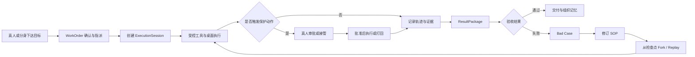

# HUMMER V3 产品原型说明书：一块工作台，一条责任链

状态：原型实现说明。产品方向遵循 `2026-08-hummer-v3-rectification-brief.md`；可信对象和状态边界遵循 `docs/architecture/mvp-contract.md`。

## 1. 产品定义

HUMMER 不是把聊天机器人堆进企业管理后台，而是一个让真人、数字分身、数字员工和受控执行机器共同完成工作单的组织协同系统。

V3 的一句话承诺：**一个工作单会生成一条可暂停、可接管、可审计、可复跑的执行会话；每个人都能在自己的责任边界内调动真人与数字员工完成工作。**

这与前期市场研究的切入点一致：先卖“可被验收的岗位闭环”，而不是先卖抽象的通用多 Agent 平台。当前演示采用 GTM 研究与合成 CRM 差异作为唯一主线；不声明真实 CRM 写入、真实桌面控制或生产级多租户已完成。

## 2. V3 设计原则

1. **四个入口，不扩增页面。** 主导航只保留工作台、团队、机器、复盘；综合管理后台是右上角的治理控制塔，而不是第五个业务页面。
2. **会话优先。** 对话、子任务、工具、能力、桌面关键帧、证据与结果包围绕同一个 `ExecutionSession`，而不是散落在多个看板。
3. **桌面必须可解释。** 每一步都有工具、参数、结果、耗时、成本、输出和证据引用；页面明确标记合成桌面与合成资源。
4. **人机换手是同等事件。** AI 转交真人、真人批准、真人接管和交还 AI 都进入轨迹，不用“已批准”冒充“已执行”。
5. **进化必须可控。** 坏例不会直接改写生产 SOP；先修改 Markdown SOP，再从检查点 fork/replay，经过验收才可沉淀。
6. **租户和治理不打扰执行。** 多账户、凭证、配额、审计和容量放在控制塔；日常工作台只展示当前会话真正需要的范围。

## 3. 信息架构

| 一级入口 | 用户要解决的问题 | 核心对象 | 原型中的交互 |
| --- | --- | --- | --- |
| 工作台 | 这件事现在做到哪一步、我该不该介入？ | WorkOrder、ExecutionSession、Trajectory、ResultPackage | 展开轨迹、审批、停止、接管、编辑 SOP、分支复跑 |
| 团队 | 谁负责，缺什么人，数字员工如何进入组织？ | HumanUser、DigitalTwin、DigitalEmployee、AgentPackage | 搜索成员、查看责任链、两步受控试用 Agent |
| 机器 | 哪台执行节点在做什么，连接器和容量是否受控？ | Worker、RuntimeProfile、Connector、Quota | 查看会话容量、隔离节点、连接或断开合成连接器 |
| 复盘 | 交付是否可信，失败怎样变成组织能力？ | ResultPackage、Evidence、BadCase、SOPRevision | 查看结果与验收、记录坏例、返回工作台从检查点复跑 |
| 综合管理控制塔 | 谁能进入哪个租户，系统是否可治理、可扩容？ | Tenant、Membership、Policy、Audit、Capacity | 多账户概览、模型路由、配额、风险、审计快照 |

保留办公室全景作为团队页中的替代叙事视图，不作为每日默认首页。能力、知识、MCP 和模型配置不再拥有独立一级入口，而以“会话能力槽”或治理控制塔出现。

## 4. 工作台主流程

### 4.1 演示脚本

1. 在“工作台”打开“华东目标账户研究与 CRM 草稿”。默认显示 L2 工作区自主、`~/GTM-2026Q3`、网络白名单、桌面只读和预算。
2. 展开任一轨迹步骤，查看 `workspace.read`、`browser.research` 的参数、结果、成本、输出和证据。
3. 点击“请求写回批准”。CRM 写回进入等待真人状态，WorkOrder 也同步进入 `awaiting_approval`。
4. 点击“批准写回”。轨迹添加“真人批准，交还 AI 执行”，生成 ResultPackage 与回滚说明。
5. 点击“我来接管”。页面明确显示真人接管合成桌面，AI 不再输入但继续记录。
6. 在 SOP 面板增加“行业优先级”规则，点击“从这里创建复跑分支”，再点击“执行复跑”。新结果会说明行业优先级造成的变化，主分支不被改写。

### 4.2 工作台交互约束

- 红色“停止”位于会话头部，除已交付或已停止外始终可一键触达。
- 审批等级是一个下拉：`L1 只建议`、`L2 工作区自主`、`L3 限额自主`。等级改变的不是文案，而是策略判定结果。
- L1 不会生成外部写入请求；L2 允许工作区内受控动作，外部写入仍需真人；L3 的实际边界由预算、系统白名单和时间窗共同限制。
- 每个工具和桌面资源都显示“合成”标识，避免原型被误解为已接管用户本地设备。
- 试用 Agent 的路径为“团队 → 试用 Agent → 立即进入受控试用”，不使用多步招聘仪式。

## 5. 角色与责任链

| 角色 | 能做什么 | 必须由谁确认 |
| --- | --- | --- |
| 真人员工 | 提出目标、接管执行、审核交付、修改岗位 SOP | 本人或上级的组织权限 |
| 数字分身 | 在主人授权范围内拆解、跟进、汇总和协调 | 保护动作仍走策略与真人门槛 |
| 数字员工 | 在 WorkOrder、能力槽和沙箱范围内执行 | 高风险工具、外部出口和预算越界 |
| 部门负责人 | 分派职责、批准本部门保护动作、验收成果 | 跨部门与高风险动作按治理策略升级 |
| 租户管理员 | 管理身份、集成、配额、模型和审计 | 不能越过租户隔离读取其他组织数据 |
| 审计员 | 查看授权范围内的轨迹、证据、审批与策略命中 | 不改变业务结论或执行状态 |

每个数字员工必须具备 owner、岗位说明书、能力版本、数据范围、预算、自治等级、生命周期与审计引用；“雇佣成功”是状态迁移，不是一个 toast。

## 6. 综合管理控制塔

控制塔服务企业管理员和安全负责人，承担三个职责：

1. **身份与租户。** 一个账号可加入多个 Tenant；切换租户不会复制数据。成员、服务身份、部门、角色、委派关系与单点登录状态均按 Tenant 作用域管理。
2. **运行与成本。** 观察活跃会话、队列延迟、节点容量、租户配额、模型路由、工具额度和异常积压；这些是运营观测，不是对吞吐能力的未经验证承诺。
3. **安全与审计。** 管理连接器凭证、策略版本、风险门槛、kill switch、可恢复事件流、证据引用与合规导出。

控制塔只提供治理面操作。它不应让管理员直接绕过正在执行 WorkOrder 的审批、版本或证据约束。

## 7. 当前原型状态

已实现：

- 四个主入口、租户切换外观和右上角控制塔入口。
- 会话领域模型：WorkOrder 状态转移、L1/L2/L3、轨迹、审批、停止、ResultPackage、SOP 修订和 fork/replay。
- 交互原型：展开轨迹、批准/打回、接管、暂停/恢复、两步受控试用、机器隔离、连接器切换、复盘标签页。
- 多账户、多租户和高并发的治理信息架构与开发边界。

尚未实现，且不得对外宣称：

- 真实外部 CRM、IM、邮件、浏览器或本地桌面写入。
- 生产身份系统、SSO/SCIM、真实凭证托管、RLS、计费和跨租户数据隔离。
- 真实消息队列、分布式 Worker、容量压测、SLO 达标或高并发生产部署。

## 8. 产品验收

1. 主导航可见入口不超过四个，治理只能通过右上角进入。
2. 用户能在一个工作台内完成“目标 → 轨迹 → 审批 → ResultPackage → 坏例 → SOP → 分支复跑”。
3. 任何保护动作都可以追溯到 WorkOrder、策略原因、真人决定、工具执行和证据引用。
4. 停止按钮常驻且一击后会话进入取消状态，令牌撤回被记录。
5. 试用数字员工不超过三步，且试用范围、期限、权限和负责人可见。
6. 原型所有本地/桌面/CRM 资源均明显标记为合成；生产能力只有在后端验收后才可打开。
